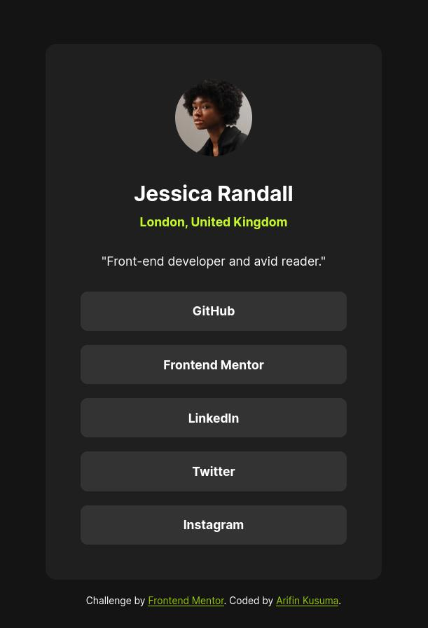

# Frontend Mentor - Social links profile solution

This is a solution to the [Social links profile challenge on Frontend Mentor](https://www.frontendmentor.io/challenges/social-links-profile-UG32l9m6dQ). Frontend Mentor challenges help you improve your coding skills by building realistic projects.

## Table of contents

- [Frontend Mentor - Social links profile solution](#frontend-mentor---social-links-profile-solution)
  - [Table of contents](#table-of-contents)
  - [Overview](#overview)
    - [The challenge](#the-challenge)
    - [Screenshot](#screenshot)
    - [Links](#links)
  - [My process](#my-process)
    - [Built with](#built-with)
    - [What I learned](#what-i-learned)
      - [No Longer Use "Font Size Hack"](#no-longer-use-font-size-hack)
      - [Use Both `px` and `rem` Units](#use-both-px-and-rem-units)
      - [Removed `px` from CSS Spacing Variables](#removed-px-from-css-spacing-variables)
      - [Setup CSS Text Preset Variables](#setup-css-text-preset-variables)
      - [`:focus-visible` Class Selector](#focus-visible-class-selector)
    - [Continued development](#continued-development)
    - [Useful resources](#useful-resources)
  - [Author](#author)
  - [Acknowledgments](#acknowledgments)

## Overview

### The challenge

Users should be able to:

- See hover and focus states for all interactive elements on the page

### Screenshot



### Links

- Solution URL: [Add solution URL here](https://your-solution-url.com)
- Live Site URL: [https://www.frontendmentor.io/challenges/social-links-profile-UG32l9m6dQ](https://www.frontendmentor.io/challenges/social-links-profile-UG32l9m6dQ)

## My process

### Built with

- Semantic HTML5 markup
- CSS custom properties
- Flexbox
- Mobile-first workflow

### What I learned

#### No Longer Use "Font Size Hack"

"Font Size Hack" is a trick to setting the font size to make it easier to write rem unit. I first knew about it from some Udemy course and I've been using it since. After read about blogs of senior web devs [^1][^2], I'm convinsed that it's better not to use it. For me the most convinsing reason is that, it will screw up the project when you insert any code that is made without the "Font Size Hack", into your code that use the "Hack", or vice versa.

What I found is actually you can use it, if you only build your own project that doesn't need any 3rd party code. But when you start to incorporate someone else code, or you start collaborating, or even further when you start working on a company, it's strongly adviced not to use it. As the most web developers out there never use it too.

So, in this challenge I use CSS `calc()` to set the values in rem.

```css
hgroup {
  gap: calc(var(--spacing-50) / 16 * 1rem);
}
```

#### Use Both `px` and `rem` Units

Before, I used rem in all of the CSS size properties. After reading explanation on Josh's blog [^2], it just makes sense to use both `px` and `rem`. We just need to know what are the properties that need `px` or `rem`, and why. Josh explains it very clearly in his blog, and no need to memorize it. When working on this challenge I didn't lookup what the props are. After coding px/rem was completed, I checked it and everything was correct. Josh teaching style is really awesome and I recommend you to read about other things too in [his blog](https://www.joshwcomeau.com).

Below is the list of properties that use px/rem unit. In summary, if you need a prop to be scaled along with the default font size, use `rem`. Otherwise, use `px`.

- `font-size`: rem.
- `max-width`: rem.
- `padding`: px.
- `gap`: rem.
- width & height of `img`: px.
- `border-radius`: px.

#### Removed `px` from CSS Spacing Variables

The Figma spacing design tokens have `px` unit attached. So I removed the unit and set it later using `calc()` function.

```css
:root {
  --spacing-300: 24;
}

.card {
  /* use px unit */
  padding: calc(var(--spacing-300) * 1px);

  /* use rem unit */
  gap: calc(var(--spacing-300) / 16 * 1rem);
}
```

#### Setup CSS Text Preset Variables

In the figma file, there are text preset design tokens containing font family, font weight, font size, line height, and letter spacing on each of the preset. I setup variables to hold these values, and then use it later by assigning it to the font property.

```css
:root {
  --text-preset-1: 700 calc(24rem / 16) / 1.5 'Inter', sans-serif;
  /* ([font weight] [font size] / [line-height] [font-family]) */
}

h1 {
  font: var(--text-preset-1);
}
```

#### `:focus-visible` Class Selector

### Continued development

Use this section to outline areas that you want to continue focusing on in future projects. These could be concepts you're still not completely comfortable with or techniques you found useful that you want to refine and perfect.

**Note: Delete this note and the content within this section and replace with your own plans for continued development.**

### Useful resources

- https://developer.mozilla.org/en-US/docs/Web/HTML/Element/hgroup
- https://www.joshwcomeau.com/css/surprising-truth-about-pixels-and-accessibility/ & https://www.joshwcomeau.com/css/surprising-truth-about-pixels-and-accessibility/#calculated-values-14
- [Example resource 1](https://www.example.com) - This helped me for XYZ reason. I really liked this pattern and will use it going forward.
- [Example resource 2](https://www.example.com) - This is an amazing article which helped me finally understand XYZ. I'd recommend it to anyone still learning this concept.

**Note: Delete this note and replace the list above with resources that helped you during the challenge. These could come in handy for anyone viewing your solution or for yourself when you look back on this project in the future.**

## Author

- Website - [Add your name here](https://www.your-site.com)
- Frontend Mentor - [@yourusername](https://www.frontendmentor.io/profile/yourusername)
- Twitter - [@yourusername](https://www.twitter.com/yourusername)

**Note: Delete this note and add/remove/edit lines above based on what links you'd like to share.**

## Acknowledgments

This is where you can give a hat tip to anyone who helped you out on this project. Perhaps you worked in a team or got some inspiration from someone else's solution. This is the perfect place to give them some credit.

**Note: Delete this note and edit this section's content as necessary. If you completed this challenge by yourself, feel free to delete this section entirely.**

[^1]: https://fedmentor.dev/posts/rem-html-font-size-hack/ Grace Snow's blog about font size hack.
[^2]: https://www.joshwcomeau.com/css/surprising-truth-about-pixels-and-accessibility/ Josh W Comeau's blog about how to choose which properties to use px/rem unit. There is also encouragement to not use the "font size hack" at the end as well.
