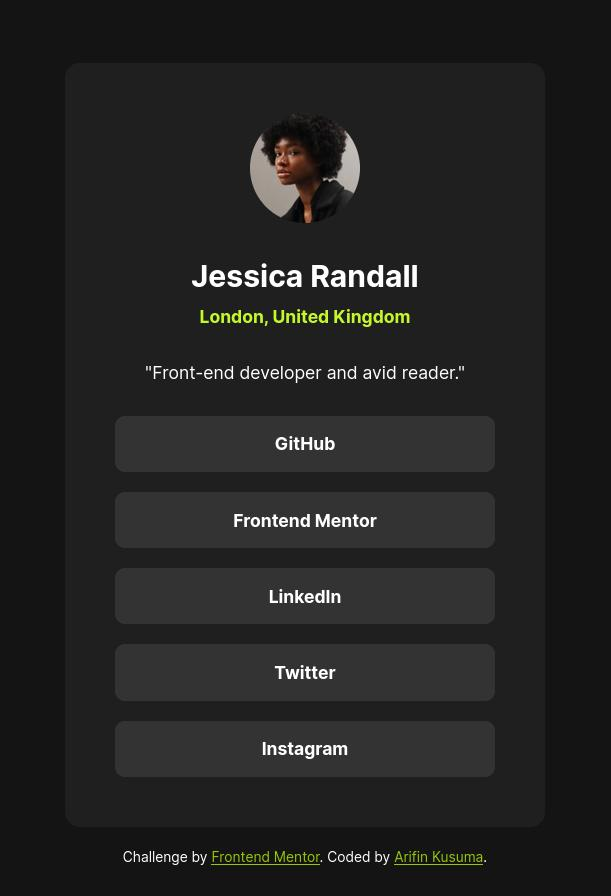
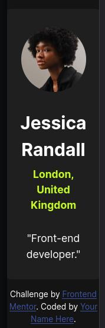
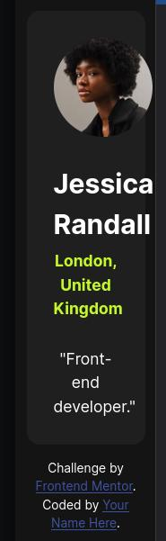
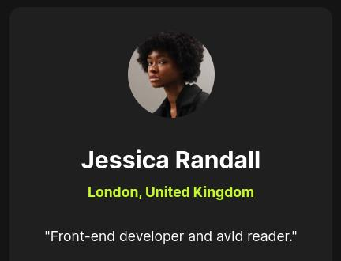
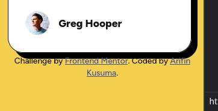
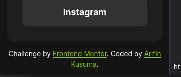

# Frontend Mentor - Social links profile solution

This is a solution to the [Social links profile challenge on Frontend Mentor](https://www.frontendmentor.io/challenges/social-links-profile-UG32l9m6dQ). Frontend Mentor challenges help you improve your coding skills by building realistic projects.

## Table of contents

- [Frontend Mentor - Social links profile solution](#frontend-mentor---social-links-profile-solution)
  - [Table of contents](#table-of-contents)
  - [Overview](#overview)
    - [The challenge](#the-challenge)
    - [Screenshot](#screenshot)
    - [Links](#links)
  - [My process](#my-process)
    - [Built with](#built-with)
    - [What I learned](#what-i-learned)
      - [🟦 `:focus-visible` Class Selectors](#-focus-visible-class-selectors)
      - [🟦 No Longer Use "Rem Font Size Hack"](#-no-longer-use-rem-font-size-hack)
      - [🟦 Use Both `px` and `rem` Units](#-use-both-px-and-rem-units)
      - [🟦 Removed `px` from CSS Spacing Variables](#-removed-px-from-css-spacing-variables)
      - [🟦 Setup CSS Text Preset Variables](#-setup-css-text-preset-variables)
      - [🟦 Solved: Card's Width Shrinks when Using `max-width`](#-solved-cards-width-shrinks-when-using-max-width)
        - [**Before and after the fix**](#before-and-after-the-fix)
      - [🟦 Removed `<nav>` from Wrapping The Links](#-removed-nav-from-wrapping-the-links)
      - [🟦 Attribution's Position](#-attributions-position)
    - [Continued development](#continued-development)
    - [Useful resources](#useful-resources)
  - [Author](#author)

## Overview

### The challenge

Users should be able to:

- See hover and focus states for all interactive elements on the page

### Screenshot



### Links

- Solution URL: [Add solution URL here](https://your-solution-url.com)
- Live Site URL: [https://finkusuma-dev.github.io/frontendmentor-social-links-profile/](https://finkusuma-dev.github.io/frontendmentor-social-links-profile/)

## My process

### Built with

- Semantic HTML5 markup
- CSS custom properties
- Flexbox
- Mobile-first workflow

### What I learned

#### 🟦 `:focus-visible` Class Selectors

There are two class selectors for element that currently in focus: `:focus` and `:focus-visible`. (Actually three, but this solution only implements two.)

From my testing, the difference between the two:

- When using `:focus` on an anchor link, and the link is clicked/tapped it will show the focus ring.
- While using `:focus-visible`, when the link is clicked/tapped it won't show the focus ring.

While using keyboard `tab` key to change focus, both show the focus ring.

On this solution, I use `:focus-visible` on the anchor links:

```css
ul.links {
  a:focus-visible {
    outline: 1px solid var(--color-green);
  }
}
```

and `:focus` on the attribution links:

```css
.attribution {
  a:focus {
    outline: 1px solid var(--color-white);
    border-radius: 1px;
  }
}
```

Hence, you will see focus ring when clicking/tapping the attribution links, but you won't see it when clicking/tapping the social links.

#### 🟦 No Longer Use "Rem Font Size Hack"

"Rem Font Size Hack" is a trick to setting the font size to make it easier to write rem unit. I first knew about it from some Udemy course and I've been using it since. After read about blogs of senior web devs [^1][^2], I'm convinsed that it's better not to use it. For me the most convinsing reason is that, it will screw up the project when you insert any code that is made without the "Hack", into your code that use the "Hack", or can be vice versa.

In some cases you can use it, if you only build your own project that doesn't need any 3rd party code. But when you start to incorporate someone else code, or start collaborating, or even further when you start working on a company, it's strongly adviced not to use it. As the most web developers out there never use it too.

So, in this challenge I use CSS `calc()` to set the values in rem.

```css
hgroup {
  gap: calc(var(--spacing-50) / 16 * 1rem);
}
```

#### 🟦 Use Both `px` and `rem` Units

Before, I always used rem in all of the CSS size properties. After reading explanation on Josh's blog [^2], it just makes sense to use both `px` and `rem`. We just need to know what are the properties that need `px` or `rem`, and why. Josh explains it very clearly in his blog. When working on this challenge I didn't lookup what the props are. After coding the px/rem was completed, I checked it and everything was correct. So no need to memorize it. Josh teaching style is really awesome and I recommend you to read about other things too in [his blog](https://www.joshwcomeau.com).

Below is the list of properties that use px/rem unit. In summary, if you need a prop to be scaled along with the default font size, use `rem`. Otherwise, use `px`.

- `font-size`: `rem`.
- `max-width`: `rem`.
- `padding`: `px`.
- `gap`: `rem`.
- width & height of `img`: `px`.
- `border-radius`: `px`.

#### 🟦 Removed `px` from CSS Spacing Variables

The Figma spacing design tokens have `px` unit attached. So I removed the `px` unit and set it later using `calc()` function. It enables me to attach px/rem unit later, depends on what is needed.

```css
:root {
  --spacing-300: 24;
}

.card {
  /* spacing variable with px unit */
  padding: calc(var(--spacing-300) * 1px);

  /* spacing variable with rem unit */
  gap: calc(var(--spacing-300) / 16 * 1rem);
}
```

#### 🟦 Setup CSS Text Preset Variables

In the figma file, there are text preset design tokens containing font family, font weight, font size, line height, and letter spacing on each of the preset. I setup CSS variables to hold these values, and then use it later by assigning it to the font property [^3].

```css
:root {
  --text-preset-1: 700 calc(24rem / 16) / 1.5 'Inter', sans-serif;
  /* ([font weight] [font size] / [line-height] [font-family]) */
}

h1 {
  font: var(--text-preset-1);
}
```

#### 🟦 Solved: Card's Width Shrinks when Using `max-width`

I set the card's `max-width` to `327px` (mobile first). Then centering the card using flexbox and set the `flex-direction` to column. The problem arises when I set up the `align-items` to `center`. The cross axis (horizontal axis) shrinks to less than `327px`.

The issue is caused by the most wide child element in the card: the description:

```html
<p>Front-end developer and avid reader.</p>
```

The total length of the `p` element is `255.9px`, added two paddings of `24px`, hence the card's width shrinks to `303.9px`.

In my testing, this happens also when the card is put inside a container and the container `width` is set to `fit-content`.

After trials, I concluded there are two ways to solve this:

1. Keep using `max-width`, but using another method to center the card.

   I know this method from a Udemy course, apparantly it's able to solve this problem. The method is using `margin-inline: auto` to make the card center horizontally and `top: 50%; transform: translateY(-50%)` to center vertically.

   ```css
   .card {
     margin-inline: auto;
     top: 50%;
     transform: translateY(-50%);
   }
   ```

   `top: 50%` means, the top position is calculated by using 50% of the parent element's height. And `-50%` on the transform property means, the card is translated in the negative Y axis (up direction) by 50% of the card's height.

2. Using `width` instead of `max-width`.

   Using `width` and by utilizing `min()` function, to choose between minimum values of 327px and 100% viewport width. If width of the viewport is more than 327px, card's width will be constrained to 327px. If less, car's width will be calculated using 100% viewport width minus paddings.

   And also to set the card's minimum width to `min-content`. Although there is no screen size that really that small, I think this is a good practice.

   ```css
   .card {
     width: min(calc(327rem / 16), calc(100vw - (24px)));
     min-width: min-content;
   }
   ```

   | With `min-content`                                | Without `min-content`                                |
   | ------------------------------------------------- | ---------------------------------------------------- |
   |  |  |

##### **Before and after the fix**

Before:


After:



#### 🟦 Removed `<nav>` from Wrapping The Links

Reading the Webdev navigation [^4], I was unsure whether or not I should use `nav` element to wrap the links. The document mentions 5 type of navigations, and all are related with the pages within the website. It doesn't mention when a page has group of links to other websites.

Thanks to discord member @Darkstar, who confirmed to not use the `nav`.

#### 🟦 Attribution's Position

I'm positioning the attribution just below the solution. But not wrapping by flex for both. The reason is, it will make the screenshot on the frontendmentor solution page to appear not in the center position. Instead I use absolute position for the attribution while wrapping both solution and the attribution inside a container.

Previously in the [blog preview card solution](https://www.frontendmentor.io/solutions/i-discovered-a-lot-of-things-on-this-blog-preview-card-challenge-pSdptSJhP1) I positioned the attribution using `bottom` property. But this create an issue. When the screen is very small, the attribution becomes 2 lines and there is no gap between the two. The reason is, the bottom of the attribution is anchored to the bottom of the container. So when it becomes two lines, the bottom stays while the top moves upward.

```css
.attribution {
  position: absolute;
  bottom: -3.5rem;
  left: 0;
  right: 0;
}
```



On this solution, I fixed it by using `top` property, so the attribution's top is anchored to the top of the container. Then, I use 100% (of the parent container's height) plus some space, to make it below the solution. The absolute position makes the attribution is removed from the normal flow layout, hence the 100% height of the parent container equals to 100% height of the solution card.

```css
.attribution {
  position: absolute;
  top: calc(100% + (24 / 16 * 1rem));
  left: 0;
  right: 0;
}
```



### Continued development

- I'm not using rem font size hack on this challenge and applying `calc()` function to make writing rem easier. I think this method is not difficult at all to use. I definitely will use this technique in the future, and maybe use the others rem techniques as well.
- To solve the card shrinks when using `max-width` inside a flex, I use `width` and `calc()` function: `width: min(calc(327rem / 16), calc(100vw - (24px)))`. Did you face this issue as well, and what was your solution?

### Useful resources

- https://developer.mozilla.org/en-US/docs/Web/HTML/Element/hgroup, MDN doc `hgroup`.
- https://developer.mozilla.org/en-US/docs/Web/CSS/:focus-visible, MDN doc `:focus-visible`.

(Note: The other resources are listed as footnote at the bottom of this README.)

## Author

- Github - [https://github.com/finkusuma-dev](https://github.com/finkusuma-dev)
- Frontend Mentor - [@finkusuma-dev](https://www.frontendmentor.io/profile/finkusuma-dev)
- Twitter - [@finkusuma_dev](https://www.twitter.com/finkusuma_dev)

[^1]: https://fedmentor.dev/posts/rem-html-font-size-hack/ Grace Snow's blog about font size hack.
[^2]: https://www.joshwcomeau.com/css/surprising-truth-about-pixels-and-accessibility/ Josh W Comeau's blog about how to choose which properties to use px/rem unit. Also mentions to not use the "font size hack" at the end as well.
[^3]: https://developer.mozilla.org/en-US/docs/Web/CSS/font, MDN doc CSS `font` property.
[^4]: https://web.dev/learn/html/navigation, Webdev navigation guide.
